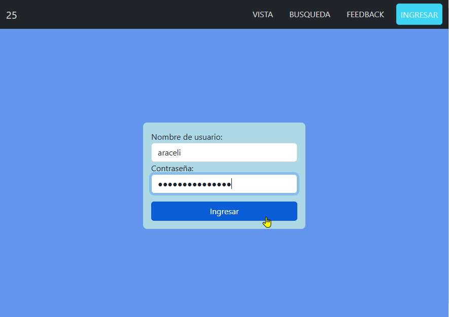

# Taller25

Reto y actividad asíncrona combinados

Funcionalidades:

- vista: sí
- busqueda: sí
- añadir: sí
- editar: sí
- eliminar: sí
- actualización de tabla tras eliminar: sí

...
<!-- 
Cuando agregué la columna cargo no actualize los parámetros de los procedures en phpAdmin, por eso los errores

los formularios de plantilla son mas rapidos pero la logica depende del html
en cambio los reactivos, depende del ts.
?

@input sirve para enviar de c-hijo a c-padre

[(ngModel)]="enlaceenambossentidos"

#referencia

#referencia="ngModel" (ahora puede hacer validaciones de tipo ngIf="referencia.invalid....")

rutas: simples o con parametros (encriptar si se necesitase enviar al url el password, el usuario, o similares)

xampp instala apache y php y te permite usar el servidor de base de datos (dbmaria)
xampp permite que apache pueda entender el lenguaje php

metodos de las api rest

get (obtener)
post 
put (enviar un array (id,nombre,...) y modificar uno) 
patch (actualizar) 
delete 

interceptor:
response => get header(auth username) body(tiene los datos)

???que hay en header request http

servicios guards:
- canActivate
- anDeativate(bloquear salida de rutas)
- canActivateChild
- canLoad
- resolve

angular material 'construido por y para angular'

en SQL
----
use certus;
call sp_Actualizar(2,'abc','asdfgh','sd@fg')

:: son el id, nombre, apellido, correo -->